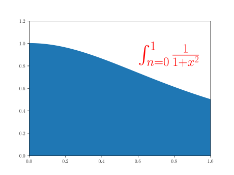

#  The Fortran Programming Language

Fortran is a programming language with a long history.
Originally developed in the 1950s, it was first created in a time before internet, laptop computers, desktop computers, before computers even have a screen.
Fortran was created in a time where computers were almost exclusively designed and operated to carry out numerical operations.
Programming in Fortran today is very different of how programmers introduce instructions and compile codes.
During the first decades of electronic computers, programming was done with punched cards, data was stored in tapes and results printed with dot matrix printers.
Over more than 60 years, the language itself have evolve to accommodate new ways of programming, new hardware, new levels of complexity and the new ways of using computers for numerical calculations.

## Evolution of Fortran

The first versions of the language introduce many of the concepts used today in most programming languages, the idea of loops, conditionals, variables.
Those elements are so commonplace today that we do not see as anything revolutionary, but FORTRAN was the first language to introduce many of those elements in programming, at least in a way the resemble the ways we program today.

The first milestone in the language was achieved with FORTRAN 77.
This standard introduce structured programming and the processing of characters.
Structured programming allow us to create larger codes and reuse pieces of code in a ways that is easier to understand for a human.
FORTRAN 77 was so successful that took more than a decade to reach an agreement over the new milestone.
Fortran 90 added array, modular and generic programming.
Those elements increase the flexibility of codes to accommodate data in run time instead of requiring constant recompilation when the parameters changed. Modules allow even larger codes introducing tools to aggregate routines with variables.
Fortran 90 left behind some issues that were solved in Fortran 95.
Fortran 95 clarify some aspects of the language and was the first to introduce some parallelization techniques (HPF) well before OpenMP and other paradigms proved to be more effective for that.
Fortran 2003 was the next big step introducing Object Oriented Programming in a way that make sense for scientific computing.
The most recent developments in the language comes from Fortran 2008 and 2018 that includes native parallel computing in the form of Coarrays.

With such extensive evolution of the language the standard retained compatibility with previous versions, being far more conservative than other languages.
Scientific codes are developed for decades and used even longer.
Many of the codes that run today on the larger supercomputers were first developed in the 1980s and could have 1 million lines of code or more.
If the language specification do not retain some compatibility many of those efforts could be lost or will become attached to older compilers losing the ability to evolve themselves.

The purpose of this lectures is to teach Fortran in the ways and styles in use today.
Searching over internet and you can find many websites teaching Fortran.
Some of those sites teach Fortran 90, some teach and show examples in FORTRAN 77 and even mixtures of those.
There are a few sites and books that present Fortran 2003 and 2008 but still with code style from older ways.
Along this lectures we will present how Fortran codes are developed today, we try to use as many Fortran 2003/2008 features as possible, examples use modern style, we completely ignore features that have become obsolete, discouraged and deprecated.

## Compiling Fortran code

Before we explore the syntax and structure of the Fortran Programming language we will fist learn how to compile any of the examples that will be presented form now on.

A code written in Fortran is a text file.
A program language has a strict a syntax for which the text file needs to follow so the compiler can produce an executable binary.

As an example we will use a relative small code.
This code implements a si
mple algorithm that computes pi.
We will use an integral formula for pi:

Integral used to converge pi

The integral will be computed by diving the range into N pieces and computing the rectangles associated to each of them.
Assuming a uniform partition in the domain, the quadrature can be computed as:

where

is some point in the interval of the rectangle.
In the implementation below we are using the middle point.

The source code is the file (``example_00.f90``)

~~~
program converge_pi

   use iso_fortran_env

   implicit none

   integer, parameter :: knd = max(selected_real_kind(15), selected_real_kind(33))
   integer, parameter :: n = huge(1)/1000
   real(kind=knd), parameter :: pi_ref = 3.1415926535897932384626433832795028841971_knd

   integer :: i
   real(kind=knd) :: pi = 0.0, t

   print *, 'KIND      : ', knd
   print *, 'PRECISION : ', precision(pi)
   print *, 'RANGE     : ', range(pi)

   do i = 0, n - 1
      t = real(i + 0.5, kind=knd)/n
      pi = pi + 4.0*(1.0/(1.0 + t*t))
   end do

   print *, ""
   print *, "Number of terms in the series : ", n
   print *, "Computed value : ", pi/n
   print *, "Reference vaue : ", pi_ref
   print *, "ABS difference with reference : ", abs(pi_ref - pi/n)

end program converge_pi
~~~
{: .language-fortran}

We will compile this code using 3 different compilers, GCC 11.1,

Load the following modules to access all those 3 compilers

~~~
$> module load lang/gcc/11.1.0 lang/nvidia/nvhpc compiler/2021.2.0
~~~
{: .language-bash}

Loading these modules we will get access to ``gfortran``, ``ifort`` and ``nvfortran``, the names of the Fortran compilers from GNU, Intel and NVIDIA respectively.

The code above can be compiled with each compiler executing:

~~~
$> gfortran example_00.f90
~~~
{: .language-bash}

~~~
$> ifort example_00.f90
~~~
{: .language-bash}

~~~
$> nvfortran example_00.f90
~~~
{: .language-bash}

When compiling the code with any of these compilers a binary file will be created.
The name of the file is by default ``a.out``.
This is convenient name for quick tests like the examples.

To run the resulting binary, type the name of the binary with a ``./``.
Otherwise, the shell will try to search for a command in the ``$PATH`` resulting on an error.

~~~
$> ./a.out
~~~
{: .language-bash}

You can also compile declaring the name of the final executable, for example using gfortran:

~~~
$> gfortran example_00.f90 -o pi
~~~
{: .language-bash}

The name of the executable will be ``pi`` and can run.

~~~
$> ./pi
~~~
{: .language-bash}

~~~
KIND      :           16
PRECISION :           33
RANGE     :         4931

Number of terms in the series :      2147483
Computed value :    3.14159265358981130850975669310991368      
Reference vaue :    3.14159265358979323846264338327950280      
ABS difference with reference :    1.80700471133098304108856024329067224E-0014
~~~
{: .output}

## Elements of the Language

Fortran uses the 26 characters of the English alphabet plus the digits plus a set of characters such as parenthesis, comma, colon, and a few others.
This restriction contrast to languages such as Julia that allow basically any UTF-8 string to be a valid variable name (including smile face, greek letters and Chinese ideograms).
In Fortran syntax lowercase letters are equivalent to uppercase, except when they are part of a character string.

In the old style of writting Fortran code that was customary with FORTRAN 77 and before, code was written in UPPERCASE.
A good style today consist in writing all the Fortran keywords in lowercase and use uppercase only for elements that are beyond the language itself such as preprocessor directives or directive-based parallelism such as OpenMP and OpenACC.

There are 4 concepts in the structure of a Fortran code: **lexical token**, **statement**, **program unit** and the **executable program**.

**Lexical tokens** are the keywords, names. labels, constants, operators and separators.
Each token has a particular meaning.
Tokens are separated by spaces and the number of spaces does not matter.
Some tokens such as parenthesis and operators can be used to separate tokens.
We will see this better with examples in our first codes.
The spacing between tokens is optional, for example "end do" and "enddo". A good coding style will prefer those tokens separated.
Most cases where token separation is optional are with "end" and some other keyword like "do", "function", "procedure", "subroutine", "block", "if" "program" and others.

In Fortran the code is written in a text file whose lines can have up to column 132.
In the old days of Fortran the first six columns have a defined use.
Today that is obsolete, you can start statements on the first line.
Comments can be made with an exclamation mark and all the characters after it will be ignored by the compiler.
Example of one statement with comments

~~~
! This is the solution to the quadratic equation
y = (-b + sqrt(b**2 - 4*a*c))/(2*a)  ! Notice the need of parenthesis
~~~

For long statements you can use up to 255 continuation lines
A single statement can be span across multiple lines using ampersand (``&``) as the last character.
The continuation line goes to the next first character in the next line, if you use another ``&`` the continuation starts in the next character after it. Example (``example_01.f90``):

~~~
program main

   ! This is pi defined as a constant
   ! Most decimals will be ignored as the default precision
   ! for a single precision real data type only provides 6 to 9
   ! significant decimals
   real, parameter :: pi = 3.14159265358979323846264338327950288419716&
                          &9399375105820974944592307816406286208998628&
                          ! This comment works here and does not interrupt
                          ! the continuation line
                          &0348253421170679821480865132823066470938446&
                          ! In standard Fortran 77, anything
                          ! beyond column 72 is ignored.
                          ! In modern Fortran the limit is 132 allowing very long lines like this one
                          &09550582231725359408128481117450284102701938521105559644622948954930381964428810975665933446128475648233&
                          ! Also comments does not count to the limit of 255 continuation lines.
                          &786783165271201909145648566923460348610454326648213393607260249141273

   print *, pi

end program
~~~
{: .language-fortran}

Multiple statements can be on one line using semicolon (``;``)

~~~
a = 1; b = 2; c = 3
~~~
{: .language-fortran}

It is not a good style to have long statements on a single line.

### types

Fortran define and operate with various **types**.
The number 3.14 is a floating point number and this is a **constant**
and you can define a **variable** ``pi = 3.14`` and pi will also be a floating point number.

Both variables and constant store data.
In variables the value they hold can change over the course of a program.
You can operate with variables and constants on the same statement, for example:

~~~
pi - 3.0
~~~
{: .language-fortran}

Fortran contains 5 **intrinsic types**: character, integer, real, logical and complex.
For each intrinsic type, we can consider variations of them, they are called ``kind`` and a non-negative integer is used to differentiate each variation.
Different from the common usage, there is nothing in the standard that the integer means the number of Bytes to store the type.

You can build extra types as combinations of those intrinsic types.
They are called **derived types**.
Multiple elements of the same type can be arranged in what is called an **array**

#### integer

On a computer using 32 bits for repreenting integers, the range of values is:

As those ranges varied between machines and compilers it is better to ask for a kind that is able to support the values that we declare.
In the example below to store numbers up to six digits:

~~~
integer, parameter :: i6 = selected_int_kind(6)
~~~
{: .language-fortran}

And number can be declared as

~~~
123456_i6.
-9_i6
~~~
{: .language-fortran}

We will discuss a variable declaration and intrinsic functions.
The point to make here is that we can control the kind of constant or variable by asking for the right ``kind`` that supports the range of interest.

#### real

The real type stores truncated real numbers.
As the internal representation of a number is binary a number such as 1.5 or 1.25 has a exact representation using the real type.
A number such as 0.1 will never be exactly represented no matter how many bits you use to represent it.
The number 0.1 in binary is:

~~~
0.00011001100110011001100110011001100110011001100110011...
~~~
{: .language-fortran}

A type real number is only able to store a truncated representation of a number.
A few numbers can be represented exactly but almost every real number needs to be truncated.
Mathematically, the number of real numbers that can be exactly represented with N bits has a Lebesgue measure of zero.

Numbers of real type are stored using some bits for the exponent and some bits for the mantissa and a couple bits for the sign of mantissa and exponent.

Same as we have for integers, we can ask for the kind that supports a given range of values, using:

~~~
integer, parameter :: r9 = selected_real_kind(9, 99)
~~~
{: .language-fortran}

In this case we are asking for the right kind to store a number with 9 significant decimal digits and between -99 and 99 for the decimal exponent.
You can ask for literal constant to be of that kind using

~~~
1.1_r9
9.1E30_r9
~~~
{: .language-fortran}

Contrary to some common belief, the Fortran Standard do not force a particular number of bit for exponent or mantissa.
Compilers abide to the IEEE standard for floating point numbers will that a range of [-37:37] for the decimal exponent and about 6 significant digits.

There are functions to inquire the kind, number of significant decimals and the range of exponents using the functions:

~~~
program main

   integer, parameter :: r9 = selected_real_kind(9, 99)

   print *, 'Information about : selected_real_kind(9, 99)'
   print *, 'KIND      : ', kind(1.1_r9)
   print *, 'PRECISION : ', precision(1.1_r9)
   print *, 'RANGE     : ', range(1.1_r9)

end program
~~~
{: .language-fortran}

The answer in gfortran on a x86_64 machine is:

~~~
 Information about : selected_real_kind(9, 99)
 KIND      :            8
 PRECISION :           15
 RANGE     :          307
~~~
{: .output}

Notice that we got 8 as the kind.
In the case of gfortran any many compilers the kind returned 8.
This number is corresponds to the number of bytes used to store the number, but that should not be assume to be 8 on a different compiler.
Notice that the values of precision and range returned are larger than the requested.
The function ``selected_real_kind`` will return a kind that meets or exceeds the expectations in terms of precision and range.

In some codes you can see variables being declared as ``REAL*8`` or ``DOUBLE PRECISION``.
Those are valid but discouraged syntax.
You should always use the kind to declare specific variants of a intrinsic type.

#### complex

Fortran, being a code for scientific computation, has natural support for complex numbers.
Complex numbers are build from two numbers, you can declare a complex number with integer or real numbers.
The internal representation will be real and of the greatest kind between the real and imaginary parts.

#### character

A string of characters for literal constants can be defined using single or double quotes (``example_03.f90``).

~~~
program main

   print *, "Using literal with double quotes, I can print ' "
   print *, 'Using literal with single quotes, I can print " '

   !print *  ` Grave accents are not valid quotes`
   !print *, ``No matter how many you use``

   print *, ""
   print *, "Lorem ipsum dolor sit amet, consectetur adipiscing elit,  &
           &       sed do eiusmod tempor incididunt ut labore et       &
           &       dolore magna aliqua. Ut enim ad minim veniam, quis  &
           &       nostrud exercitation ullamco laboris nisi ut aliquip&
           &       ex ea commodo consequat. Duis aute irure dolor in   &
           &       reprehenderit in voluptate velit esse cillum dolore &
           &       eu fugiat nulla pariatur. Excepteur sint occaecat   &
           &       cupidatat non proident, sunt in culpa qui officia   &
           &       deserunt mollit anim id est laborum."

end program main
~~~
{: .language-fortran}

When coping code from the a webpage, sometimes, you get strings using the grave accent (`` ` ``).
This kind of quote is not valid and will fail during compilation.

#### logical

The last type of literal constant is the logical type.
Values can be ``.true.`` or ``.false.``

## Names

Fortran is extremely flexible for creating names for entities inside a program.
Different from other languages, there are no reserved words in the language.
This a valid, but terrible way of naming variables (``example_04.f90``)

~~~
program main

   integer :: program = 1
   real :: real = 3.14
   character :: print = 'this'

   print *, program
   print *, real
   print *, print

end program
~~~
{: .language-fortran}

The only rule is that a name must start with a letter and consist only of alphanumeric characters without spaces.
Out a this minimal rule, the programmer has a lot of freedom to choose names.
Some common sense guidelines for choosing names are:

  * Use names with some meaning, except for dummy indices like i, j, k, n and m.
  * Names with multiple characters are easy to search on a text editor.
  * Too long names are hard to write and prone to typos.
  * Link multi word names with underscores like ``electron_density`` or use    camel case like ``ElectronDensity``.
  * Remember that Fortran is insensity to case and that includes names, so ``electron_density`` and ``Electron_Density`` are the same.

## Variables

We have use variables before and we will formalize the structure.
Example (``example_05.f90``)

~~~
program main

   integer(kind=4) :: i = 9, j
   real(kind=8) :: x = 3.14, y, z
   complex(kind=4) :: sec = (-1, 1)
   character(len=20, kind=1) :: word = "Electron"
   logical(kind=1) :: is_good, is_bad

   print *, 'Integer   : ', i
   print *, 'Real      : ', x
   print *, 'Complex   : ', sec
   print *, 'Character : ', word
   print *, 'Logical   : ', is_good

end program
~~~
{: .language-fortran}

We are using numbers for the kinds for simplicity.
Remember that those are not standard and should not be used assuming certain value.
Each statement declaring a variable has the name of the type, optionally in parenthesis the kind and in the case of characers, the lenght and the kind.
Two colons separate a list of variables separated by coma and initial values given on the same statement.

## Derived types

Beyond the 5 intrinsic types you can create your own types by grouping several other types intrinsic or not inside what is called a **derived type**

This example shows how to create, instantiate (create structure) and access the internals of a derived type (``example_06.f90``):

~~~
program main

   type position
      real :: x, y, z
   end type position

   type atom
      character(20) :: atom_name
      character(3)  :: symbol
      integer       :: atom_Z
      real          :: electronegativity
      type(position):: atom_pos
   end type atom

   type(atom) :: gold = atom('Gold', 'Au', 79, 2.54, position(1.0, -1.125, 3.5))

   gold%atom_Z = 79

   print *, 'Name       : ', gold%atom_name
   print *, 'Z          : ', gold%atom_Z
   print *, 'Position Z : ', gold%atom_pos%z

end program
~~~
{: .language-fortran}

In the example above, atom is a derived type.
``atom_name``, ``symbol``, ``atom_Z`` and ``electronegativity``
are **components** of the atom type.
``atom_pos`` is also a **component** and it is itself a derived type.

The variable gold is a **structure** of the atom type.
For initializing gold we used the **type constructor** ``atom('Gold', 'Au', 79, 2.54, position(1.0, -1.125, 3.5))`` and the position itself was constructed.

The percentage (``%``) symbol is a **component selector** for the internal pieces an atom type.
If the component is also a derived type more (``%``) are used for the internal structures of the variable.

Despite a complex being an intrinsic variable, it uses the percentage (``%``) to access the pseudo components ``re`` and ``im``.

## Arrays

Arrays is one of strengths of the Language.
Many other programming languages such as Matlab and Python, took inspiration from Fortran to express complex descriptions of data in arrays.

An array is an uniform arrangement of elements of the same type and type parameters.
Arrays can one or more dimensions.
The dimension is established with the attribute **dimension**.
The language impose a limit of 15 dimensions which is more than is practical today.
An array with 15 dimension and 10 elements on each dimension will require almost 1 PB of memory.

Different from other languages such as C or Python, by default array indices start in 1.
The bounds of a Fortran array can be define as arguments of the attribute **dimension**.
The number of dimensions of an array is called **rank**.
The number of elements on each dimension is called **extent**
The sequence of extends for all the dimensions is called the **shape**

The way data is stored for an array is extremely important for computatonal performance.

An array

~~~
real, dimension(3,3)  :: a
~~~
{: .language-fortran}

has the following contiguous Elements

~~~
a(1,1) a(2,1) a(3,1) a(1,2) a(2,2) a(3,2) a(1,3) a(2,3) a(3,3)  
~~~
{: .language-fortran}

When we discuss loops on arrays the internal faster loop must run over the internal most contiguous index.
This is the complete opposite from the way a language like C represent multidimensional arrays.

Sections of arrays can be referenced using the colom notation ``a(i:j)``, where elements in indices ``i`` up to ``j`` are returned. Array **sections**
cannot be sectioned again.

### Constructors

Array constants can be defined in two notations.

~~~
a = (/ 1, 2, 3, 4, 5, 6, 7, 8 /) ! Old Notation
b = [ 2, 4, 6, 8, 10, 12, 14, 16 ]   ! Fortran 2003 notation
~~~

There are constructors for constant arrays using implicit loops.
The arrays

~~~
a = (/ (i, i=1, 8) /)
b = [ (i, i=2, 16, 2) ]
~~~
{: .language-fortran}

### Allocatables

One of the big innovations of Fortran 90 was the inclusion of **Dynamic memory allocation** via the attribute ``allocatable`` for arrays.
Before memory allocation, programmers create arrays of predefined size, sometimes overestimating the size of the array or demanding recompilation each to adjust the size of arrays to different problems.

An allocatable array is defined like this:

~~~
real, dimension(:, :), allocatable :: a
~~~
{: .language-fortran}

When the variable is first created it is in **unallocated** state.
Allocation and deallocation is done with the ``allocate`` and ``deallocate``

~~~
allocate(a(n,-m:m))
...
deallocate(a)
~~~
{: .language-fortran}

## Strings of characters

There is a special way of declaring strings of characters.

~~~
character(len=34) :: name
~~~
{: .language-fortran}

Despite of being formally different from an array of characters many of the notation for addressing elements and extracting portions of arrays hold for strings

## Pointers

A variable that refers to other variable is called a **pointer**.
Pointers are powerful means of declaring operations that apply to different elements using a notation that uses those pointers to as the name says, point to a different variable each time.

Declaration is as follows:

~~~
integer, pointer :: pn
real, pointer    :: px
real, pointer, dimension(:,:) :: pa
~~~
{: .language-fortran}

What happens behind curtains is that each of those variables use a portion of memory to contain a **descriptor**, that holds not only the memory location, but also the type, and in the case of arrays, bounds and strides.

When a pointer is created, it is by default **undefined**, i.e there is no way to know if they point something.
A pointer can be nullified with:

~~~
real, pointer    :: px => null()
~~~
{: .language-fortran}

This is the recommended way of creating pointers as the state can be determined.
During the code, the code can point to other variables and can be null again with:

~~~
nullify(pa, px)
~~~
{: .language-fortran}

## Expressions and Statements

Variables and constants interact with each other via operators.
For example when you write:

~~~
c = b + 5
~~~
{: .language-fortran}

You are using the **dyadic** operator plus (``+``) and use the variable ``b`` and constant ``5``.
The result of that operation is **assigned** ie stored in the memory associated to ``c``.

Most operators are dyadic but there are also **monadic** operators such as minus (``-``) when used isolated.

Expressions without parentheses are evaluated successively from left to right for operators of equal precedence, except for exponent ``**`` that is operated first.
For example

~~~
f = a/b/c/d
~~~
{: .language-fortran}

Is actually computed as ``a/b`` then the result divided by ``c`` and finally the result divided by ``d``. At the end of calculation, the final value is assigned to ``f``

This operation can be actually be computed as

~~~
f = a/(b*c*d)
~~~
{: .language-fortran}

As compilers could identify that divisions are more computationally expensive than multiplications and prefer a single division.

For exponents the evaluation is right to left, for example ``a**b**c`` is evaluated as ``a**(b**c)``

Division between integers return integer, the value truncated, not rounded example:

~~~
12/3  is 4
14/3  is 4
~~~
{: .language-fortran}

When numbers of different type operate the return is for the stronger type and the weakest type is promoted before operation.

Numerical variables can be promoted to different type using functions

| Type    | Convertion Fuction       |
|---------|--------------------------|
| integer | int(expr, kind(variable))|
| real    | real(expr, kind(variable)) |
| complex | compl(expr, kind(variable)) |

You can use the same function to change inside the same type but different kind.

Operators that return boolean

| Operator | Description           |
|----------|-----------------------|
| <        | Less than             |
| >        | Greater than          |
| <=       | Less than or equal    |
| >=       | Greater than or equal |
| ==       | equal                 |
| /=       | not equal             |

Booleans themselves receive operators:

| Operator | Description           |
|----------|-----------------------|
| .not.    | logical negation      |
| .and.    | logical intersection  |
| .or.     | logical union         |
| -eqv.    | logical equivalent    |
| .neqv.   | logical non-euivalent |

## Array Expressions

Operations over arrays are greatly simplified by using the concept of **conformable** arrays.
Two arrays are conformable if the have the same **shape*, ie, the same dimension, and the same number of elements on each dimension.
The actual indices can differ.
Scalars are conformable to any array and the value will operate one-to-one over each element of the array.

Consider an array:

~~~
real, dimension(30,10) :: a, b
real, dimension(10) :: v
~~~
{: .language-fortran}

The following operations are valid

~~~
a/b      ! Array with shape [30,10] with entries a(i,j)/b(i,j)
b+3.14   ! Array with shape [30,10] with values b(i)+3.14
v + b(11:20, 10) | Array with shape [10]
a == b   ! Boolean comparison, .true. if all individual comparisons are true
~~~
{: .language-fortran}

## Control Constructs

Programs with just a linear sequence of statements cannot produce the right flow of instructions needed even by a simple algorithm.
Control constructs are build with **blocks**, some keyword at the very beginning and a final **end ...** at the end.
Control constructs can be nested and a outer block cannot **end** before all nested blocks are also ended.

There are two major sets of controls.
Those that diverge the execution based on an expression being true or false.
These kind of controls are called **conditionals**.
The typical conditional in Fortran is the ``if _expression_ else _statements_ end if``

There are also controls that repeat the contents of a block a certain number of times or until a condition is reached.
Those are called **loops**.
The usual loop in Fortran is the ``do  statements end do``

### Conditional ``if``

The conditional ``if`` is used when the execution can go to at most one case.
It could do nothing or having more test conditions, but only one block will be executed. Conditional as any block can be named:

The following example is good fore reference:

~~~
posneg: if (x > 0) then
  print *, 'Positive number'
else if (x < 0 ) then
  print *, 'Negative number'
else
  print *, 'Value is zero'
end if posneg
~~~
{: .language-fortran}

The conditional has a name (``posneg``) and this is optional.
The ``else if`` and ``else`` are optional too.
The else clause in case it exists, must be the final clause.

For very quick conditional there is one line form that is useful

~~~
if (x /= 0) print *, 'Non zero value'
~~~
{: .language-fortran}

### Conditional ``case``

The second conditional in fortran is ``case``.
In this case there is only one evaluation but multitple blocks can be executed based on a selector and selector.
There is also an option for a default value that is executed if any of the other cases were.

Example:

~~~
select case
   case (:-1)
      x = -1.0
case (0)
      x = -1E-8
case (3:)
      x = 3.14
default
      x = 0.0
end select
~~~
{: .language-fortran}

### Loop ``do``

The ``do`` loop has a rich construct that is able to not doing anything to run an infinite loop. ``do`` loops is one of the oldest constructs in fortran and have received a lot of variations over different Fortran versions.

For this introductory lesson a simple form is shown.
As example consider a simple but not particularly efficient way of computing a matrix multiplication:

~~~
do i = 1, n
   do j = 1, m
      a(i,j) = 0.0
      do l = 1, k
         a(i,j) = a(i,j) + b(i,l)*c(l,j)
      end do
   end do
end do
~~~
{: .language-fortran}

There are two special statements that alter the repetition in ``do`` loops.
``exit`` skips entirely the loop and set the program to continue on the first line after ``end do``.
With nested cycles it is possible to abandon an outer loop from an inner loop and we will see this on the advanced hour.

``cycle`` will skip one run and set the execution just before ``end do``, meaning that the next iteration will take place but all the code after the ``cycle`` will be skipped.
Consider this simple example:

~~~
do c = 1, 100
  dis = b**2 - 4*a*c
  if dis < 0 exit
end do
~~~
{: .language-fortran}

## Programs, Procedures and Modules

A program is composed of a set of variable definition, assigments, statements, control blocks such as loops and conditionals conditionals.
All those pieces of code are organized in programs, procedures and modules.

This is a brief review of each of them and will provide the bare minimum to start writing simple programs on your own.

Any program has at least one main program. We have already used one for our first example. The basic structure of a main program is

~~~
program name

! variable definitions
...

! statements
...

end program
~~~
{: .language-fortran}

Writing an entire code in a single program is possible but will produce a code with a lot of redundancy and very hard of maintain.
The next level of complexity is to take pieces of code and convert them in procedures.
There are two kinds of procedures: A **function** and a **subroutine**
The difference is that functions return a single value and usually does not alter the input (at least to be aligned to the concept of mathematical function).
A subroutine does not return anything so it cannot be included as part of an expression, but it can change the arguments, effectively giving a mechanism to alter the state of the variables and the calling program.
A subroutine is called using the clause ``call``

The next level is to group procedures, functions and types into a coherent structure called **modules**.
Modules are powerful way of structuring large codes.
Even small codes benefit from modules as they offer type checking that internal procedures will not offer.

Some examples will clarify these concepts needed for the exercises proposed later on.

A very minimal program will be something like:

~~~
program test
   print *, ’Hello world!’
end program test
~~~
{: .language-fortran}

This program has just one statement, no variables, not calls to subroutines or functions. This program itself written in a file can be compiled and the code executed.
See the first section of this lesson where we show how to compile a code like this.

Apart from the program there are **subprograms**, their structure is very similar to the main program but the resulting code can only be called from other program or subprogram.

A subroutine is defined as

~~~
subroutine sub(a, x, y)
   real, intent(in) :: a
   real, intent(in), dimension(:) :: x
   real, intent(out), dimension(:) :: y

   y = a*x

end subroutine
~~~
{: .language-fortran}

The subprogram **function** is similar to subroutines but they can be called on expressions and typically will not change the arguments.

One example:

~~~
function distance3D(p1, p2)

  real :: distance = 0.0
  real, intent(in), dimension(3) :: p1, p2
  integer :: i

  do i=1, 3
    distance = distance + (p1(i)-p2(i))**2
  end do

  distance = sqrt(distance)

end function distance3D
~~~
{: .language-fortran}

## Input and Output

Such short introduction to the language will inevitably leave several topics completely uncovered.
Input/Output is a quite complex topic for such short lecture.  

What follows is just the bare minimum for producing rudimentary but effective output on the screen and receiving input from the keyboard or command line.

We have use the ``print`` clause, it is quite simple to use like this:

~~~
print *, 'VAR 1: ', var1, 'VAR2: ', var2
~~~
{: .language-fortran}

This clause will print on the standard output, which by default the shell associate to the terminal.

### Command Line Arguments

One of the novelties of 2003 is to allow Fortran programs to read from the command line.
Consider this example:


