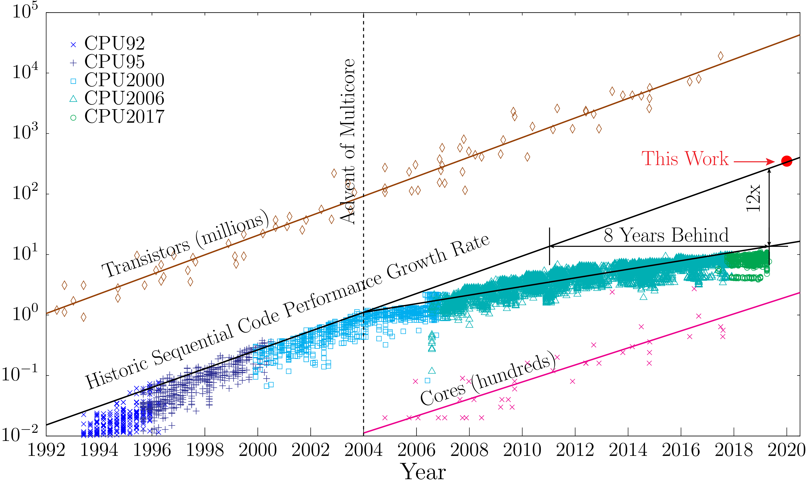
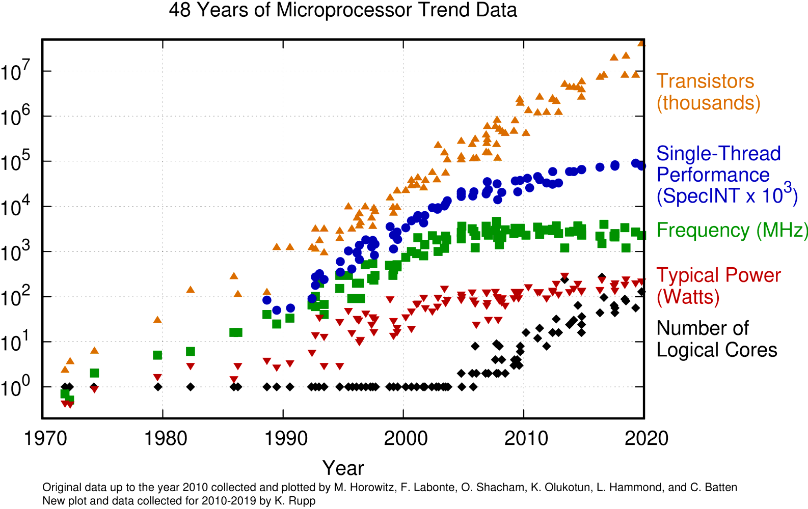

# Why Parallel Computing?

Since the around the 90s Fortran designers understood that the era of programming for a single CPU will be abandoned very soon.
At that time, vector machines exist but they were in use for very specialized calculations.
It was around 2004 that the consumer market start moving out of having a single fast CPU with a single processing unit into a CPU with multiple processing units or cores.
Many codes are intrinsically serial and adding more cores did not bring more performance out of those codes.
The figure below shows how a serial code today runs 12 times slower that it could if the increase in performance could have continue as it were before 2004.
That is the same as to say that the code today runs at a speed that could have been present 8 to 10 years ago with if the trend could have been sustained up to now.

Evolution over several decades of the number of transistors in CPUs, Performance of Serial codes and number of cores
 
From <a href="https://liberty.princeton.edu/Projects/AutoPar/"> Princeton Liberty Research Group </a>

The reason for this lack is not a failure in Moore's law when measured in the number of transistors on CPUs.

A logarithmic graph showing the timeline of how transistor counts in mircochips are almost doubling every two years from 1970 to 2020; Moore's Law.
 
From <a href="https://ourworldindata.org/uploads/2020/11/Transistor-Count-over-time.png"> Our World in Data </a> Data compiled by Max Roser and Hannah Ritchie

The fact is that instead of faster CPUs computers today have more cores on each CPU, machines on HPC cluster have 2 or more CPU sockets on a single mainboard and we have Accelerators, machines with massive amounts of simple cores that are able to perform certain calculations more efficiently than contemporary CPU.

Evolution of CPUs in terms of number of transistors, power consumption and number of cores.
 
From <a href="https://github.com/karlrupp/microprocessor-trend-data"> Karl Rupp Github repo</a> Original data up to the year 2010 collected and plotted by M. Horowitz, F. Labonte, O. Shacham, K. Olukotun, L. Hammond, and C. Batten" at 1970,6e-3 tc ls 1 font ",8"
New plot and data collected for 2010-2019 by K. Rupp

It should be clear that computers today are not getting faster and faster over the years as it was the case during the 80s and 90s.
Computers today are just getting marginally faster if you look at one individual core, but today we have more cores on a machine and basically every computer, tablet and phone around us is multiprocessor.

It could be desirable that parallelism could be something that a computer deals automatically.
The reality is that today, writing parallel code or converting serial code, ie codes that are supposed to run on a single core is not a trivial task.

## Parallel Programming in Fortran

After the release of Fortran 90 parallelization at the level of the language was considered.
High Performance Fortran (HPF) was created as an extension of Fortran 90 with constructs that support parallel computing,
Some HPF capabilities and constructs were incorporated in Fortran 95.
The implementation of HPF features was uneven across vendors and OpenMP attract vendors to better support OpenMP over HPF features.
In the next sections we will consider a few important technologies that bring parallel computing to the Fortran Language.
Some like coarrays are part of the language itself, others like OpenMP, OpenACC, are directives added as comments to the sources and compliant compilers can use those directives to provide parallelism. CUDA Fortran is an superset of the Fortran language and MPI a library for distributed parallel computing.
In the following sections a brief description of them.

### Fortran coarrays

One of the original features that survived was coarrays.
Coarray Fortran (CAF), started as an extension of Fortran 95/2003 but it reach a more mature standard in Fortran 2008 with some modifications in 2018.

The following example is our simple code for computing pi written using coarrays.
(``example_01.f90``)

~~~
program pi_coarray

   use iso_fortran_env
   implicit none

   integer, parameter :: r15 = selected_real_kind(15)
   integer, parameter :: n = huge(1)
   real(kind=r15), parameter :: pi_ref = 3.1415926535897932384626433_real64

   integer :: i[*]
   integer :: n_per_image[*]
   real(kind=r15) :: real_n[*]
   real(kind=r15) :: pi[*] = 0.0
   real(kind=r15) :: t[*]

   if (this_image() .eq. num_images()) then
      n_per_image = n/num_images()
      real_n = real(n_per_image*num_images(), r15)

      print *, 'Number of terms requested : ', n
      print *, 'Real number of terms      : ', real_n
      print *, 'Terms to compute per image: ', n_per_image

      do i = 1, num_images() - 1
         n_per_image[i] = n_per_image
         real_n[i] = real(n_per_image*num_images(), r15)
      end do

   end if

   sync all

   ! Computed on each image
   do i = (this_image() - 1)*n_per_image, this_image()*n_per_image - 1
      t = (real(i) + 0.05)/real_n
      pi = pi + 4.0/(1.0 + t*t)
      !print *, 'IMAGE:', this_image(), 'I:', i, 'PI:', pi
   end do

   sync all

   if (this_image() .eq. num_images()) then

      do i = 1, num_images() - 1
         !print *, pi[i]/real_n
         pi = pi + pi[i]
      end do

      print *, "Computed value", pi/real_n
      print *, "abs difference with reference", abs(pi_ref - pi/n)
   end if

end program pi_coarray
~~~
{: .language-fortran}

You can compile this code using the Intel Fortran compiler which offers an integrated support for Fortran coarrays in shared memory.

~~~
$> $ ifort -coarray example_01.f90
~~~
{: .language-fortran}

~~~
$> ./a.out
 Number of terms requested :   2147483647
 Real number of terms      :    2147483616.00000     
 Terms to compute per image:     44739242
 Number of images          :           48
 Computed value   3.14159265405511     
 abs difference with reference  4.488514004918898E-008
~~~
{: .output}

When the code runs, multiple processes are create, each of them is called an ``image``.
The execute the same executable and the processing could diverge by using a unique number that can be inquired with the intrinsic funtion ``this_image()``.
In the example above, we distribute the terms in the loop across all the images.
Each image computes different terms of the series and store the partial sum in the variable pi.
The variable pi is defined as a coarray with using the ``[*]`` notation.
That means that each individual has its own variable pi but still can transparently access the value from other images.

At the end of the calculation, the last image is collecting the partial sum from all other images and returning the value obtained from that process.

### OpenMP

OpenMP was conceived originally as an effort to create an standard for shared-memory multiprocessing (SMP). Today, that have changed to start supporting accelerators but the first versions were concerned only with introduce parallel programming directives for multicore processors.

With OpenMP  you can go beyond the directives and use an API, using methods and routines that explicitly demand the compiler to be compliant with those parallel paradigms.

One of the areas where OpenMP is easy to use is parallelizing loops, same as we did using coarrays and as we will be doing as example for the other paradigms of parallelism .

As an example, lets consider the same program used to introduce Fortran.
The algorithm that computes pi using a quadrature. (``example_02.f90``)

~~~
program converge_pi

   use iso_fortran_env

   implicit none

   integer, parameter :: knd = max(selected_real_kind(15), selected_real_kind(33))
   integer, parameter :: n = huge(1)/1000
   real(kind=knd), parameter :: pi_ref = 3.1415926535897932384626433832795028841971_knd

   integer :: i
   real(kind=knd) :: pi = 0.0, t

   print *, 'KIND      : ', knd
   print *, 'PRECISION : ', precision(pi)
   print *, 'RANGE     : ', range(pi)

   !$OMP PARALLEL DO PRIVATE(t) REDUCTION(+:pi)
   do i = 0, n - 1
      t = real(i + 0.5, kind=knd)/n
      pi = pi + 4.0*(1.0/(1.0 + t*t))
   end do
   !$OMP END PARALLEL DO

   print *, ""
   print *, "Number of terms in the series : ", n
   print *, "Computed value : ", pi/n
   print *, "Reference vaue : ", pi_ref
   print *, "ABS difference with reference : ", abs(pi_ref - pi/n)

end program converge_pi
~~~
{: .language-fortran}

This code is almost identical to the original code the only difference resides on a couple of comments before and after the loop:

~~~
!$OMP PARALLEL DO PRIVATE(t) REDUCTION(+:pi)
do i = 0, n - 1
   t = real(i + 0.5, kind=knd)/n
   pi = pi + 4.0*(1.0/(1.0 + t*t))
end do
!$OMP END PARALLEL DO
~~~
{: .language-fortran}

This comments are safely ignored by a compiler that does not support OpenMP.
A compiler supporting OpenMP will use those instructions to create a executable that will span a number of threads.
Each thread could potentially run on independent cores resulting on a parallelization of the loop.
OpenMP also include features to collect the partial sums of ``pi``.

To compile this code each compiler provides arguments that enable the support for it.
In the case of GCC the compilation is:

~~~
$> gfortran -fopenmp example_02.f90
~~~
{: .language-bash}

For the Intel compilers the argument is ``-qopenmp``
~~~
$> ifort -qopenmp example_02.f90
~~~
{: .language-bash}

On the NVIDIA Fortran compiler the argument is ``-mp``.
The extra argument ``-Minfo=all`` is very useful to receive a feedback from the compiler about sections of the code that will be parallelized.

~~~
$> nvfortran -mp -Minfo=all example_02.f90
~~~
{: .language-bash}

### OpenACC

OpenACC is another directive-based standards for parallel programming.
OpenACC was created with to facilitate parallelism not only for multiprocessor but also to external accelerators such as GPUs.

Same as OpenMP, in OpenACC the programming is carried out by adding some extra lines to the serial code that are comments from the point of view of the language but interpreted by a compliant language that is capable of interpreting those lines and parallelize the code according to them. The lines of code added to the original sources are called directives. An ignorant compiler will just ignore those lines and the code will execute as before the introduction of the directives.

An accelerator is a device specialized on certain numerical operations.
It usually includes an independent memory device and data needs to be transferred to the device's memory before the accelerator can process the data.
The figure below show an schematic of one multicore machine with 3 GPUs attached to it.

As we did for OpenMP, the same code can be made parallel adding a few directives.

~~~
...
!$ACC KERNELS
do i=0, n-1
  t = (real(i)+0.05)/n
  pi = pi + 4.0/(1.0+t*t)
end do
!$ACC END KERNELS
...
~~~
{: .language-fortran}

Both OpenMP and OpenACC operate by adding special directives to the original sources. I want to stress the similarities before we analyze the differences.

Edit the original file ``pi.f90`` to create a new file ``pi_omp.f90`` with the change above for OpenMP. Do the same to create the file ``pi_acc.f90`` for the file using OpenACC.

For the OpenACC version of the code the compilation line is:

~~~
$> gfortran -fopenacc pi_acc.f90 -o pi_acc
~~~
{: .language-bash}

Intel compilers do not support OpenACC

~~~
$> nvfortran -acc -Minfo=all pi_acc.f90 -o pi_acc
~~~
{: .language-bash}

Using directives instead of extending the language offers several advantages:

  * The original source code continues to be valid for those compilers that do know about OpenMP or OpenACC, there is no need to fork the code. If you stay at the level of directives, the code will continue to work without the parallelization.

  * The directives provides a very high level abstraction for parallelism. Other solutions involve deep knowledge about the architecture where the code will run reducing the portability to other systems. Architectures evolve over time and hardware specifics will become a burden for maintainers of the code when it need to be adapted to newer technologies.

  * The parallelization effort can be done step by step. There is no need to start from scratch planning important rewrites of large portions of the code with will come with more bugs and development costs.

An alternative to OpenMP could be pthreads, and alternative to OpenACC could be CUDA. Both alternatives suffer from the items mentioned above.

Despite of the similarities at this point, OpenMP and OpenACC were created targeting very different architectures. The idea being that eventually both will converge into a more general solution. We will now discuss each approach separately, at the end of this discussion we will talk about the efforts to converge both approaches.


