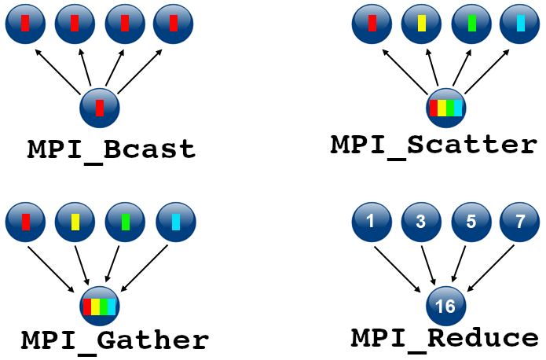
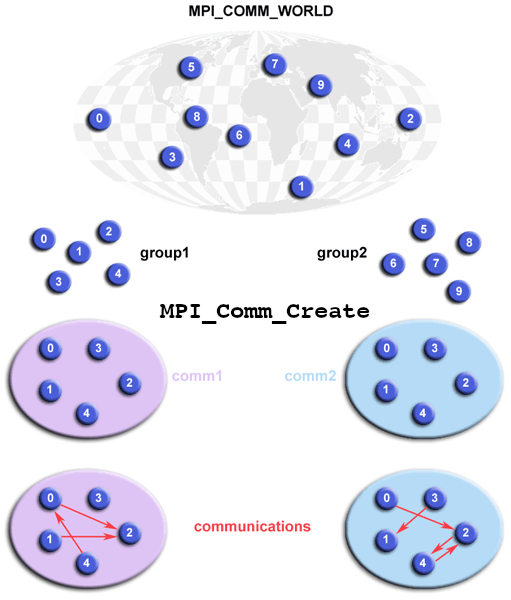

### More Collectives: Scatter and Gather

Collective Communications

The ``MPI_Bcast`` and ``MPI_Reduce`` operations have more complex analogs that are very useful in a variety of algorithms.
Just like ``MPI_Bcast`` and ``MPI_Reduce``, the benefit of using these routines, instead of point-to-point messages, is not only syntactical convenience but also much better efficiency.
They allow for swaths of data to be distributed from a root process to all other available processes, or data from all processes can be collected at one process.
These operators can eliminate the need for a surprising amount of boilerplate code via two functions:
Keep in mind that these are called "collective" because every PE in the communicator must call these routines at the same time.
Let’s take a look at the basic idea, and then we’ll see the wide variety of related routines.

~~~
USE mpi_f08
MPI_Scatter(sendbuf, sendcount, sendtype, recvbuf, recvcount, recvtype,
        root, comm, ierror)
    TYPE(*), DIMENSION(..), INTENT(IN) :: sendbuf
    TYPE(*), DIMENSION(..) :: recvbuf
    INTEGER, INTENT(IN) :: sendcount, recvcount, root
    TYPE(MPI_Datatype), INTENT(IN) :: sendtype, recvtype
    TYPE(MPI_Comm), INTENT(IN) :: comm
    INTEGER, OPTIONAL, INTENT(OUT) :: ierror

MPI_Gather(sendbuf, sendcount, sendtype, recvbuf, recvcount, recvtype,
        root, comm, ierror)
    TYPE(*), DIMENSION(..), INTENT(IN) :: sendbuf
    TYPE(*), DIMENSION(..) :: recvbuf
    INTEGER, INTENT(IN) :: sendcount, recvcount, root
    TYPE(MPI_Datatype), INTENT(IN) :: sendtype, recvtype
    TYPE(MPI_Comm), INTENT(IN) :: comm
    INTEGER, OPTIONAL, INTENT(OUT) :: ierror    
~~~
{: .language-fortran}

In order to get a better grasp on these functions, let’s go ahead and create a program that will utilize the scatter function.
Note that the gather function (not shown in the example) works similarly, and is
essentially the converse of the scatter function.
Further examples which utilize the gather function can be found in the MPI tutorials
listed as resources at the beginning of this document.

#### Example of Scatter

This example shows how to spread the values of a 2 dimensional array across multiple processes

~~~
program scatter
   use mpi_f08

   integer, parameter :: nsize = 8
   integer :: numtasks, rank, sendcount, recvcount, source, ierr
   real, allocatable ::  sendbuf(:, :), recvbuf(:)

   call MPI_INIT(ierr)
   call MPI_COMM_RANK(MPI_COMM_WORLD, rank, ierr)
   call MPI_COMM_size(MPI_COMM_WORLD, numtasks, ierr)

   allocate (sendbuf(nsize, numtasks))
   allocate (recvbuf(nsize))
   sendbuf = reshape([(i, i=1, nsize*numtasks)], [nsize, numtasks])

   if (rank == 0) then
      print *, ''
      print *, 'Original array to be distributed:'
      do i = 1, numtasks
         print *, sendbuf(:, i)
      end do
      print *, ''
   end if

   call MPI_BARRIER(MPI_COMM_WORLD)

   source = 1
   sendcount = nsize
   recvcount = nsize
   call MPI_SCATTER(sendbuf, sendcount, MPI_REAL, recvbuf, recvcount, MPI_REAL, &
                    source, MPI_COMM_WORLD, ierr)

   print *, 'rank= ', rank, ' recvbuf: ', recvbuf

   call MPI_FINALIZE(ierr)

   deallocate (sendbuf, recvbuf)

end program
~~~
{: .language-fortran}

## Group and Communicator Management Routines

Groups and Communications

### Groups and Communicators

A group is an ordered set of processes. Each process in a group is associated with a unique integer rank.
Rank values start at zero and go to N-1, where N is the number of processes in the group.
In MPI, a group is represented within system memory as an object.
It is accessible to the programmer only by a “handle”.
A group is always associated with a communicator object.

A communicator encompasses a group of processes that may communicate with each other.
All MPI messages must specify a communicator.
In the simplest sense, the communicator is an extra “tag” that must be included with MPI calls.
Like groups, communicators are represented within system memory as objects and are accessible to the programmer only by “handles”.
For example, the handle for the communicator that comprises all tasks is MPI_COMM_WORLD.

From the programmer’s perspective, a group and a communicator are one.
The group routines are primarily used to specify which processes should be used to construct a communicator.

### Primary Purposes of Group and Communicator Objects:

  * Allow you to organize tasks, based upon function, into task groups.
  * Enable Collective Communications operations across a subset of related tasks.
  * Provide basis for implementing user defined virtual topologies.
  * Provide for safe communications.

### Programming Considerations and Restrictions:

Groups/communicators are dynamic - they can be created and destroyed during program execution.

Processes may be in more than one group/communicator. They will have a unique rank within each group/communicator.

MPI provides over 40 routines related to groups, communicators, and virtual topologies.

### Typical usage:

  * Extract handle of global group from MPI_COMM_WORLD using MPI_Comm_group
  * Form new group as a subset of global group using MPI_Group_incl
  * Create new communicator for new group using MPI_Comm_create
  * Determine new rank in new communicator using MPI_Comm_rank
  * Conduct communications using any MPI message passing routine
  * When finished, free up new communicator and group (optional) using MPI_Comm_free and MPI_Group_free

### Example of a use of Groups

~~~
program group                                                                         
   use mpi_f08                                                                        

   implicit none       

   integer :: nsize, i                                                                
   integer :: rank, new_rank, sendbuf, recvbuf, numtasks, ierr
   integer, dimension(:), allocatable :: ranks1(:), ranks2(:)
   type(MPI_Group) :: orig_group, new_group  ! MPI 3.0
   type(MPI_Comm) :: new_comm

   call MPI_INIT(ierr)
   call MPI_COMM_RANK(MPI_COMM_WORLD, rank, ierr)
   call MPI_COMM_SIZE(MPI_COMM_WORLD, numtasks, ierr)

   if (mod(numtasks, 2) /= 0) then
      print *, 'Enter a even number of processes '
      call MPI_FINALIZE(ierr)
      stop
   end if

   allocate (ranks1(numtasks/2))
   allocate (ranks2(numtasks/2))

   ranks1 = [(i, i=0, size(ranks1) - 1)]
   ranks2 = [(size(ranks1) + i, i=0, size(ranks2) - 1)]

   sendbuf = rank

   ! extract the original group handle
   call MPI_COMM_GROUP(MPI_COMM_WORLD, orig_group, ierr)

   ! divide tasks into two distinct groups based upon rank
   if (rank < numtasks/2) then
       call MPI_GROUP_INCL(orig_group, numtasks/2, ranks1, new_group, ierr)
   else
       call MPI_GROUP_INCL(orig_group, numtasks/2, ranks2, new_group, ierr)
   end if

   ! create new new communicator and then perform collective communications
   call MPI_COMM_CREATE(MPI_COMM_WORLD, new_group, new_comm, ierr)
   call MPI_ALLREDUCE(sendbuf, recvbuf, 1, MPI_INTEGER, MPI_SUM, new_comm, ierr)

   ! get rank in new group
   call MPI_GROUP_RANK(new_group, new_rank, ierr)
   print *, 'rank= ', rank, ' newrank= ', new_rank, ' recvbuf= ', recvbuf

   call MPI_FINALIZE(ierr)
end program
~~~
{: .language-fortran}


